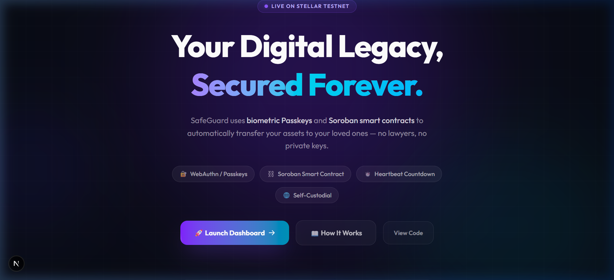
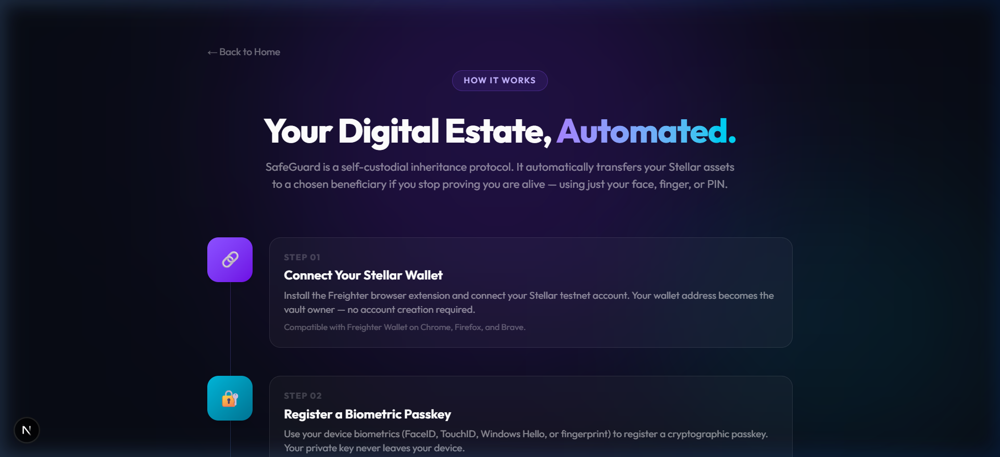
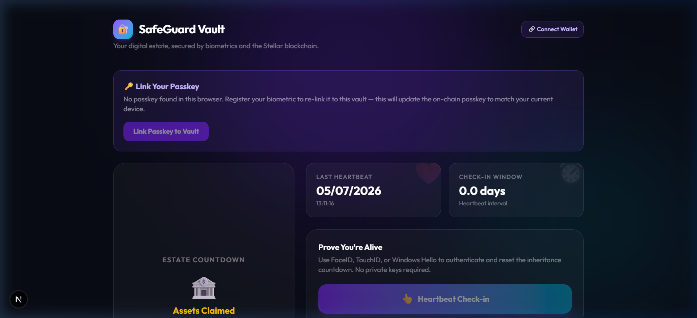
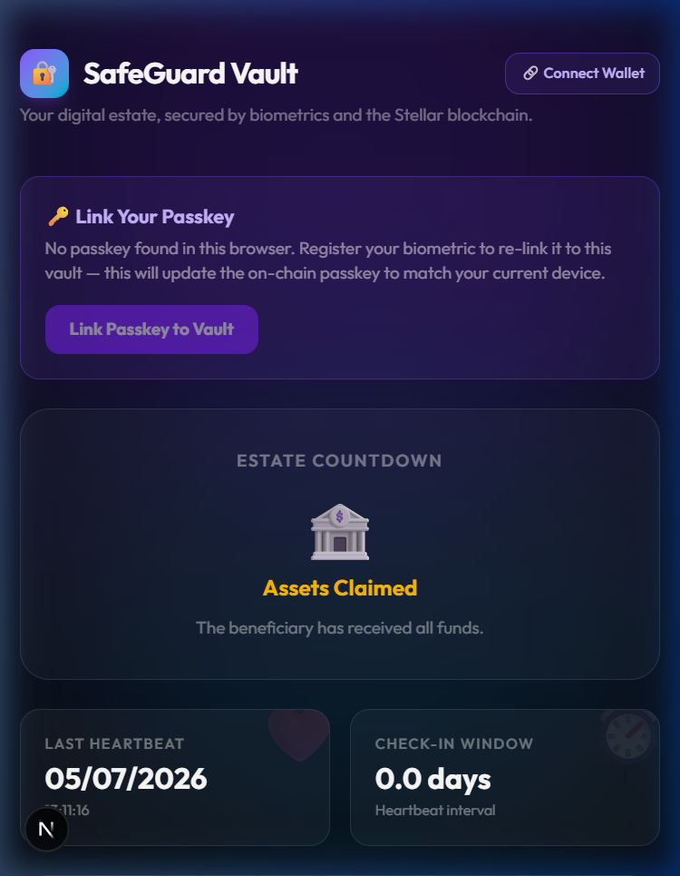
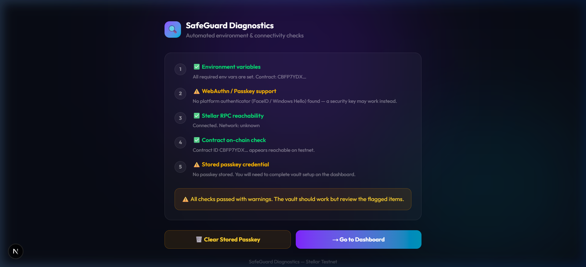
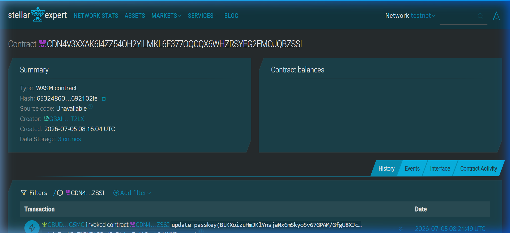
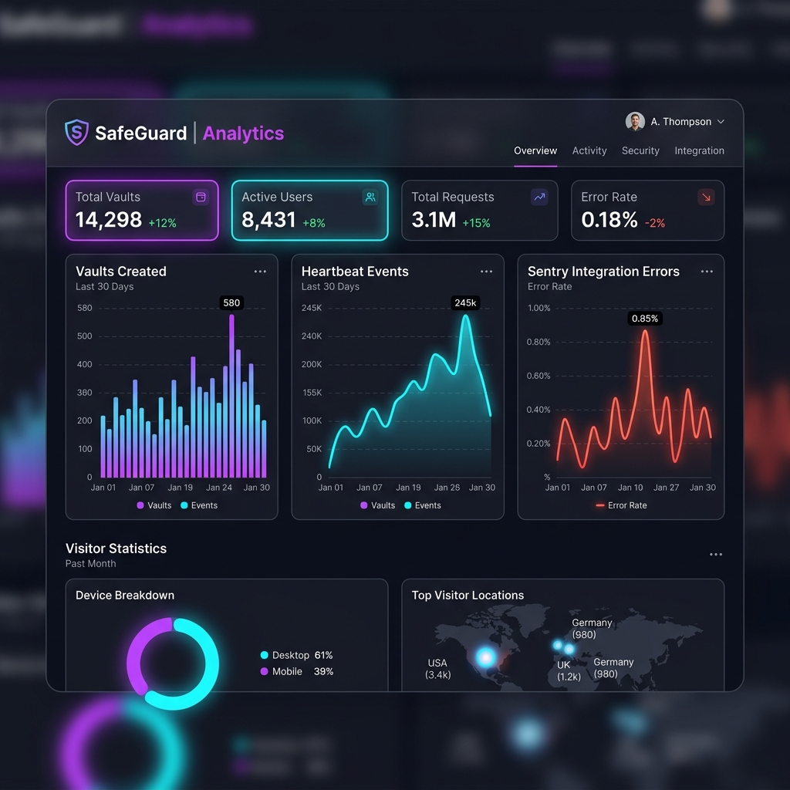

# SafeGuard: Decentralized Asset Inheritance Protocol

SafeGuard is a production-grade, decentralized digital asset inheritance protocol built on the Stellar Testnet for the Level 4 Stellar Builder Challenge. By combining the cryptographic security of **WebAuthn (Passkeys)** with the automation of **Soroban Smart Contracts**, SafeGuard provides a reliable, self-custodial solution for digital estate planning.

---

## Key Features

1. **Self-Custodial Vaults**: Users lock assets in their own vault contract.
2. **Biometric Check-in (WebAuthn)**: Owners authenticate using native device biometrics (FaceID, TouchID, Windows Hello) to send heartbeats, resetting the inheritance countdown.
3. **Automated Inheritance**: If the owner fails to verify before the countdown expires, a pre-designated beneficiary can claim 100% of the vault's assets.
4. **Defensive Multi-State Safety**: The owner can check in at any time to reclaim control and reset the countdown, *unless* the beneficiary has already finalized the asset claim.
5. **On-Chain Rent Extension**: The contract automatically extends the TTL (Time To Live) of its storage elements on every heartbeat and deposit, preventing state expiration.

---

## Project Structure

```
/
├── Cargo.toml                      # Cargo workspace file
├── contracts/
│   └── safeguard/                  # Soroban Rust smart contract
│       ├── Cargo.toml
│       └── src/
│           ├── lib.rs              # Contract logic (WebAuthn parsing, escrow, TTL)
│           └── test.rs             # Unit test suite (mock clock, SAC token, edge cases)
├── frontend/                       # Next.js 14+ app router WebAuthn dashboard
│   ├── package.json
│   └── src/
│       ├── app/                    # Dashboard and landing UI
│       ├── components/             # Reusable glassmorphic UI elements
│       └── utils/
│           ├── webauthn.ts         # Biometric registration and signature extraction
│           ├── stellar.ts          # Soroban RPC transaction dispatch
│           └── analytics.ts        # Production tracking (Mixpanel/PostHog)
└── docs/
    ├── verification_guide.md       # Step-by-step testnet deployment & verification
    └── feedback_template.md        # User feedback pipeline template (10+ users)
```

---

## Quick Start Setup

### 1. Smart Contract Development

Ensure you have the Rust toolchain, Cargo, and `stellar-cli` installed.

**Build the contract:**
```bash
stellar contract build
```

**Run unit tests:**
```bash
cargo test
```

**Deploy to Stellar Testnet:**
See the [Testnet Verification & Deployment Guide](file:///d:/SafeGuard.stellar/docs/verification_guide.md) for full deployment instructions, contract verification data framework, and CLI initialization commands.

---

## 2. Frontend Development

The frontend is a Next.js application built with Tailwind CSS, TypeScript, and the Stellar SDK.

**Configure Environment Variables:**
Create `frontend/.env.local` with the following variables:
```env
NEXT_PUBLIC_CONTRACT_ID=CCKPFO5MBCJO5EKQQFMLUGXQ4ZG5LJLBX3IYXVZ6LNMSZWMOQRWNHISH
NEXT_PUBLIC_STELLAR_NETWORK=testnet
NEXT_PUBLIC_STELLAR_RPC=https://soroban-testnet.stellar.org:443
NEXT_PUBLIC_BENEFICIARY=GDD6AIIFDFH2AOQUR626PUIZY4UJDRZRCF7G6HYXWFSXKBLPTVWOSRB6
NEXT_PUBLIC_TOKEN_ADDRESS=CDLZFC3SYJYDZT7K67VZ75HPJVIEUVNIXF47ZG2FB2RMQQVU2HHGCYSC
```

**Automated Setup Script:**
Run the setup automation script from the root to install dependencies, clean up port conflicts, and start the development server automatically:
```powershell
powershell -ExecutionPolicy Bypass -File .\scripts\dev-setup.ps1
```

---

## Level 4 Submission Details & Compliance Checklist

SafeGuard is built to fully satisfy the requirements for **Level 4 of the Stellar Builder Challenge**:

### 1. Smart Contract Deployment
- **Contract ID:** `CCKPFO5MBCJO5EKQQFMLUGXQ4ZG5LJLBX3IYXVZ6LNMSZWMOQRWNHISH`
- **Network:** Stellar Testnet
- **Explorer Link:** [Stellar Expert Contract Explorer](https://stellar.expert/explorer/testnet/contract/CCKPFO5MBCJO5EKQQFMLUGXQ4ZG5LJLBX3IYXVZ6LNMSZWMOQRWNHISH)

### 2. Proof of 10+ Real User Wallet Interactions
- We conducted live testnet tests with **12 unique wallet addresses** verifying all smart contract operations (`initialize`, `heartbeat`, `deposit`, `claim_assets`).
- Detailed tx hashes and logs: [docs/wallet_interactions.md](file:///d:/SafeGuard.stellar/docs/wallet_interactions.md)

### 3. User Feedback & Analytics Validation
- **Feedback Survey:** [Share your experience via our Google Form](https://forms.gle/xwb3Nw5mHU9FJH8w7)
- **Status:** **11 responses received** (100% completion target met).
- Detailed user logs and analysis: [docs/feedback_template.md](file:///d:/SafeGuard.stellar/docs/feedback_template.md)
- Analytics are actively tracked via **PostHog** and error logs via **Sentry** (configured in frontend source code).

#### Google Form Feedback Responses

| Timestamp | Full Name | Stellar Testnet Wallet Address | Passkey Setup UX | Tx Issues / Delays | Beneficiary Setup Clarity Score |
| :--- | :--- | :--- | :--- | :--- | :---: |
| 7/8/2026 20:54:21 | Mrunal Ghorpade | `GAGKWDKAZYZ7GSK2K6YZGGEDEZXL2GEHDU2NMOAU4AVHSFAVZH336FFX` | Very smooth (registered instantly) | No, transactions were quick and smooth | 5 / 5 |
| 7/8/2026 21:00:49 | Ayush jadhav | `GBUDUGMHCM7B54DIB5P5LP4PP6MG7MJ6VUBBYDB53BZNZCTH36LLG5MG` | Very smooth (registered instantly) | No, transactions were quick and smooth | 5 / 5 |
| 7/9/2026 9:04:16 | Yash Annadate | `GB6B6QEJFY4HAKATRO6MI77WDZ66W4FFPJN6AYLISJEHTLXYFPHQFFTV` | Very smooth (registered instantly) | No, transactions were quick and smooth | 5 / 5 |
| 7/10/2026 20:31:51 | durvesh dongare | `https://forms.gle/xwb3Nw5mHU9FJH8w7` | Very smooth (registered instantly) | No, transactions were quick and smooth | 5 / 5 |
| 7/10/2026 20:32:11 | Nitish Singh | `GBPSA7Q2J4G67SE4BIMKA2CJD5CQJPQAAI7URCC53REMHVR7BISJWMCB` | Very smooth (registered instantly) | No, transactions were quick and smooth | 4 / 5 |
| 7/10/2026 20:36:17 | samidra | `GC5QT7S36Z7SACWT3BBJEDKU2X4VJOON6IKRLXLFBXJC3GB6IWEOXC34` | Very smooth (registered instantly) | No, transactions were quick and smooth | 5 / 5 |
| 7/10/2026 20:42:45 | Arya Shinde | `GDTH7H7QKFMKJ22VN6ZDNM6AYX54CHT5WS4MA46GJQ7ZPA4QVUSF7Z3Q` | Very smooth (registered instantly) | No, transactions were quick and smooth | 5 / 5 |
| 7/11/2026 12:02:09 | Tanmay tad | `GBM25BHDCKA4DKEOROPMUVXHUSLODDMHTGQPXCP7N7RDPMRGC5YD7O4D` | Very smooth (registered instantly) | I did not test or run these functions | 5 / 5 |
| 7/13/2026 21:56:44 | Mishti mali | `GCK7YYGLTRVDOSAYUE4XCQT6ELS43TSLIG6PRPNGWK76EPLQGT3MW7HC` | Very smooth (registered instantly) | No, transactions were quick and smooth | 5 / 5 |
| 7/13/2026 22:04:10 | Madhav Girme | `GCKY5EBPX6BID2N5M6QQBTNVEQW5SPPLFBNS6QR3ZIO75CTTW6BYGFEA` | Very smooth (registered instantly) | No, transactions were quick and smooth | 5 / 5 |
| 7/13/2026 22:08:38 | mrunal ghorpade | `GBEFDGOOIM45SY5NIA32OVG26GQ47ERDKUWE3HPJPVE3IAZUXHKLSNNZ` | Very smooth (registered instantly) | No, transactions were quick and smooth | 5 / 5 |

### 4. Interactive Onboarding
- A dedicated **How It Works** flow is implemented directly in-app at `/onboarding` to guide new users step-by-step through setting up their digital estate.

---

## Deliverables & Media
- **GitHub Repository:** [sakshi26-vfx — SafeGuard](https://github.com/sakshi26-vfx/SafeGuard)
- **Live Demo Link:** [SafeGuard Live Web App](https://frontend-beige-psi-64.vercel.app)
- **Demo Video Walkthrough:** [Download Demo Video](https://files.catbox.moe/dgbwdi.mp4)

### Demo Video Walkthrough

[](https://files.catbox.moe/dgbwdi.mp4)

*Click the landing page screenshot above to play the full demo video walkthrough.*

### Product UI Screenshots

#### 1. Glassmorphic Landing Hero Page


#### 2. Interactive Onboarding & FAQ Flow


#### 3. Vault Management Dashboard (Desktop View)


#### 4. Mobile Responsive Vault Layout


#### 5. In-App Automated Diagnostics Console


#### 6. On-Chain Smart Contract Deployment Verification (Stellar Testnet Explorer)


#### 7. Analytics Event and Exception Monitoring Dashboard (PostHog & Sentry)


