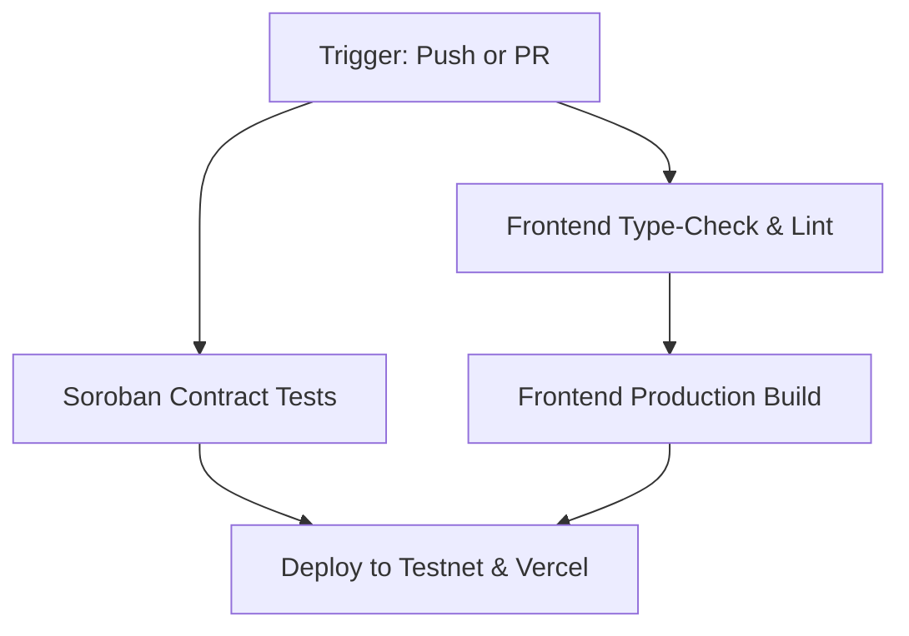

# SafeGuard Automated CI/CD Pipeline Setup Guide

This guide explains how SafeGuard's GitHub Actions CI/CD pipeline works and how to configure GitHub Secrets to automatically build, test, and deploy the application.

---

## Workflow Overview

The CI/CD pipeline is configured in [.github/workflows/ci.yml](file:///d:/SafeGuard.stellar/.github/workflows/ci.yml) and runs on every push or pull request to the `main` or `develop` branches. It consists of the following automated jobs:

1. **Soroban Contract Tests:** Compiles the Rust smart contract and executes the comprehensive Rust unit test suite.
2. **Frontend Type-Check & Lint:** Performs static analysis, running TypeScript compilation checks (`tsc --noEmit`) and ESLint audits.
3. **Frontend Production Build:** Validates that the Next.js production build completes with no compilation errors.
4. **Deploy to Testnet & Vercel (Main Branch Only):**
   - Automatically installs the Stellar CLI.
   - Generates and funds a fresh temporary deployer identity.
   - Deploys the smart contract to the Stellar Testnet.
   - Deploys the Next.js frontend to Vercel (if Vercel secrets are provided).

---

## Configuring Vercel Deployment Secrets

To enable GitHub Actions to automatically deploy the frontend to Vercel on every push to `main`, configure the following GitHub Secrets:

### Step 1: Generate a Vercel Personal Access Token
1. Go to your **Vercel Account Settings > Tokens**.
2. Click **Create** to generate a new token. Set the scope to your team/account.
3. Copy the token.

### Step 2: Add Secrets to GitHub
1. Go to your GitHub repository: `https://github.com/sakshi26-vfx/SafeGuard`.
2. Click **Settings** (top navigation bar) > **Secrets and variables** (left sidebar) > **Actions**.
3. Click **New repository secret** and add the following three secrets:

| Secret Name | Value | Description |
|---|---|---|
| **`VERCEL_TOKEN`** | `your_token_here` | The token generated in Step 1. |
| **`VERCEL_ORG_ID`** | `team_PzOpy7oaXnNCoEOiXL0lzgiF` | Your Vercel team/organization ID (pre-configured in [project.json](file:///d:/SafeGuard.stellar/frontend/.vercel/project.json)). |
| **`VERCEL_PROJECT_ID`** | `prj_00vdmq82HYAKKKssbu5D5lY4MTHv` | Your Vercel project ID (pre-configured in [project.json](file:///d:/SafeGuard.stellar/frontend/.vercel/project.json)). |

Once these secrets are set up, every push to `main` will trigger a full build, run contract tests, deploy the contract, and update the live website on Vercel automatically.
